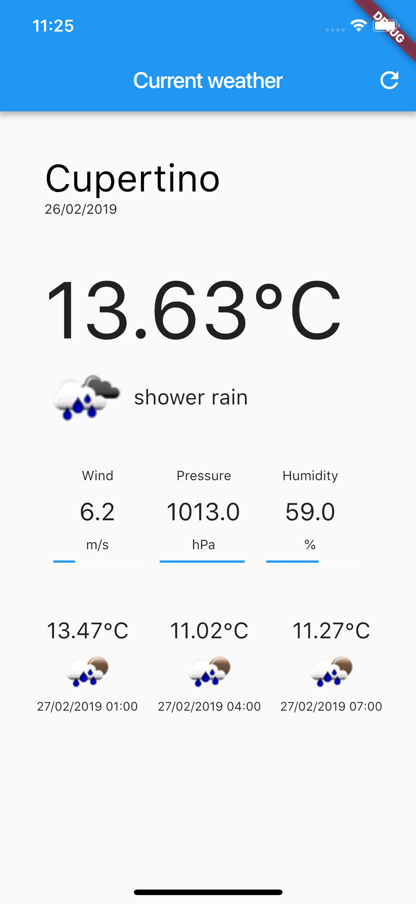
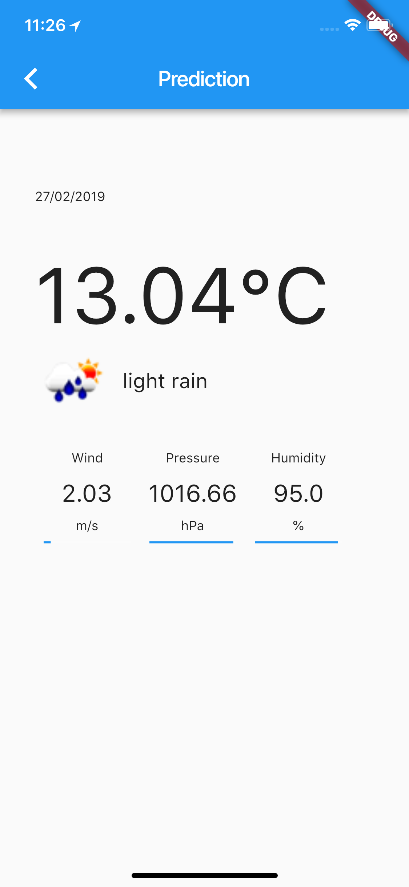

# Weather APP

Platform: Flutter.

A project that shows you the weather and the forecast for the next five days in your current location.
* Uses openweather [API](https://openweathermap.org/api)
* Written in dart.
* Fully unit and UI tested

## Art

    
    

